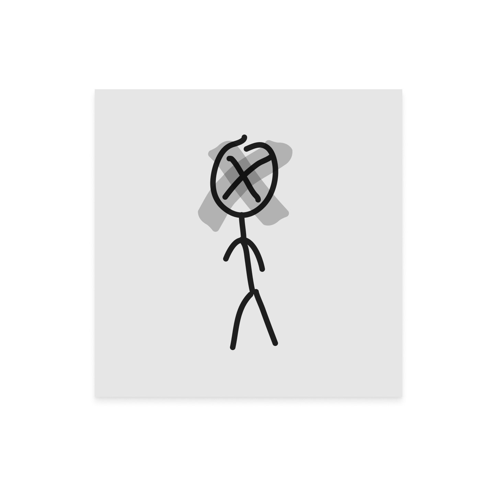

# Passwords



---

## 💡 About

PassGenerator is a password generation program that allows you to combine keywords, 
years and random characters. It generates passwords matching a given length using a randomized 
selection of elements and their combinations. This program can also generate seed-phrases

---

## 🚀 Installation

   ```bash
   git clone https://github.com/DRWOOTANYU/Passwords.git
   
   cd Passwords
   
   make
   
   sudo chmod 777 PasswordsGenerator

   ./PasswordsGenerator